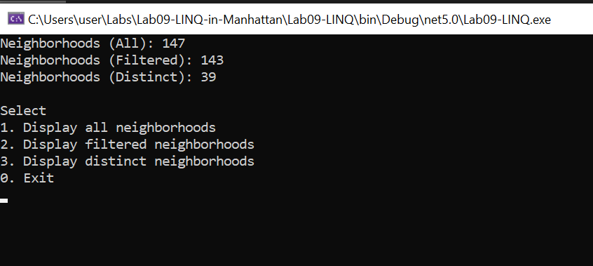

# Lab09-LINQ-in-Manhattan
This is a Console apllication aim to Read and Filter data from a json file.

## Visual
Here is the start of the aplication: 

we can select "1" for All Neighborhoods or "2" for only neighborhoods with Names or "3" for a list of Neighborhoods without duplicate or "0" to Exit.

The third option:  
